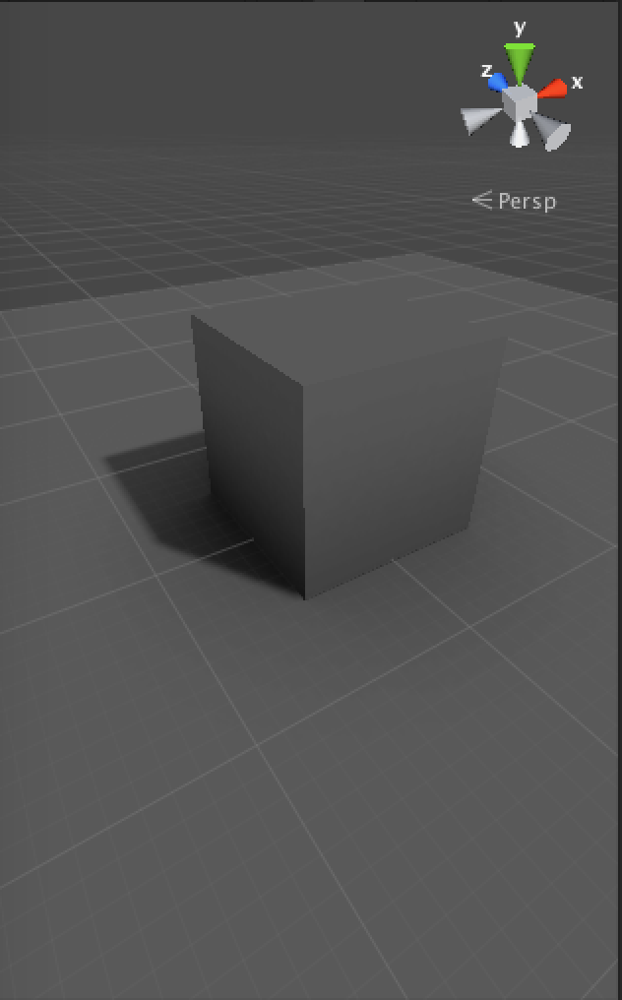
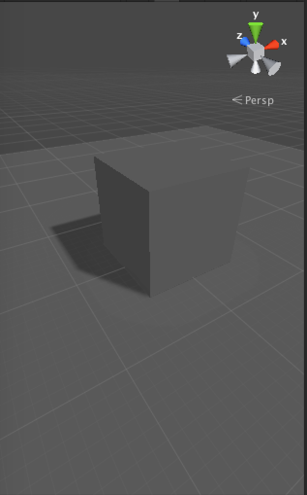

#环境光遮蔽效果

AO效果|无AO效果
---|---
 | 

参考自百度百科
>
Ambient Occlusion, 中文翻译为**环境光遮蔽**，是用来描绘物体和物体相交或靠近的时候遮挡周围漫反射光线的效果，可以解决或改善漏光、漂和阴影不实等问题，解决活改善场景中缝隙、褶皱与墙角、角线以及细小物体等的表现不清晰问题，综合改善细节尤其是暗部阴影，增强空间的层次感、真实感，同事加强和改善画面明暗对比，增强画面的艺术性。

参考自维基百科
>
In computer graphics, ambient occlusion is a shading and rendering technique used to calculate how exposed each point in a scene is to ambient lighting. 

##实现方式
###烘焙
一种方式是使用游戏引擎静态烘焙，这是最方便和低成本的使用方式。

参考本文开头的对比图片，这是用Unity GI的烘焙效果，开启了LightMap和AO。
###实时计算
SSAO