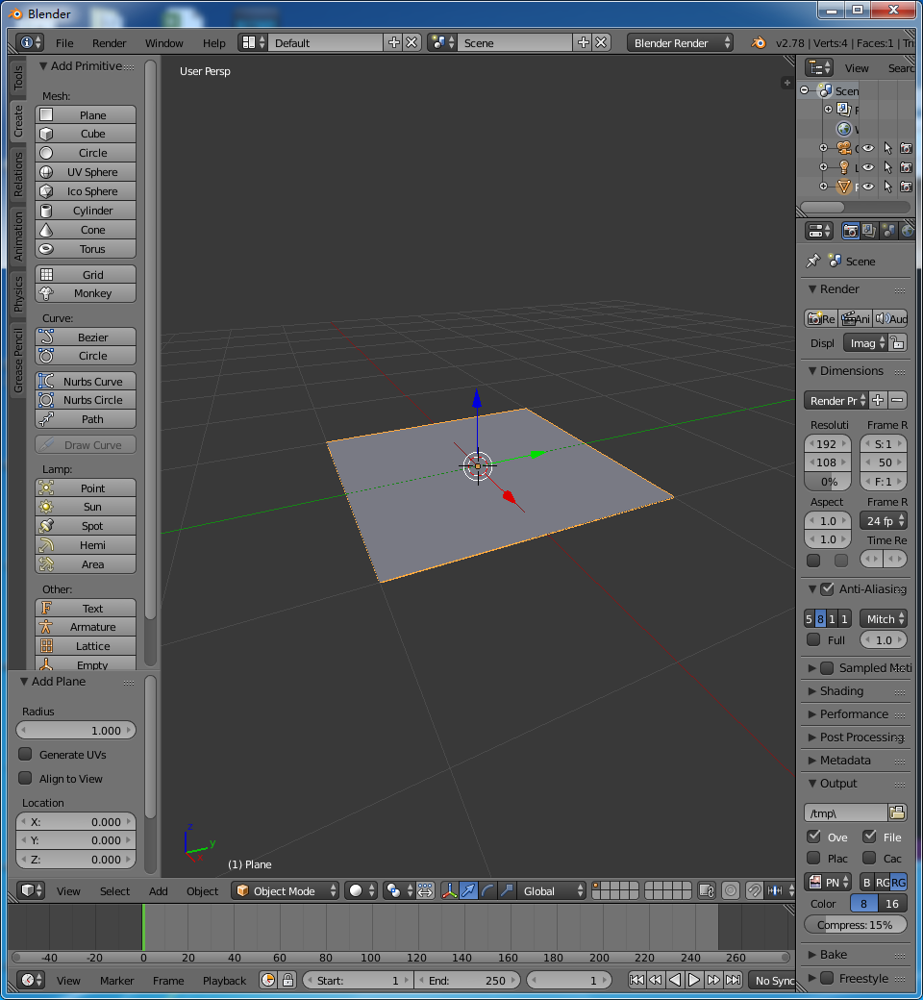
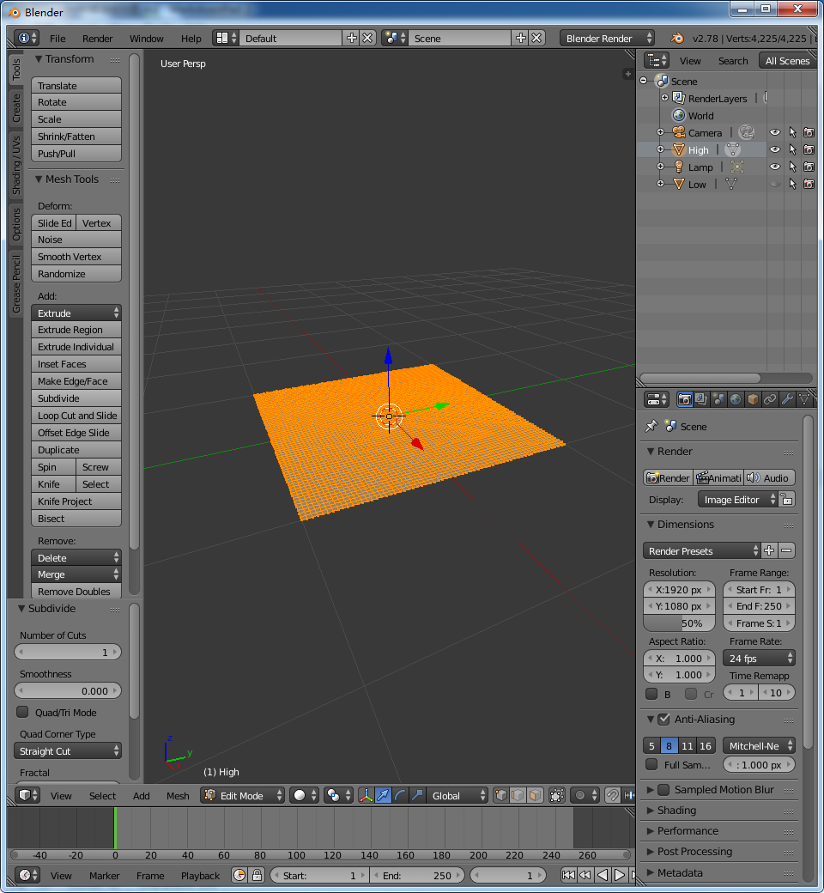
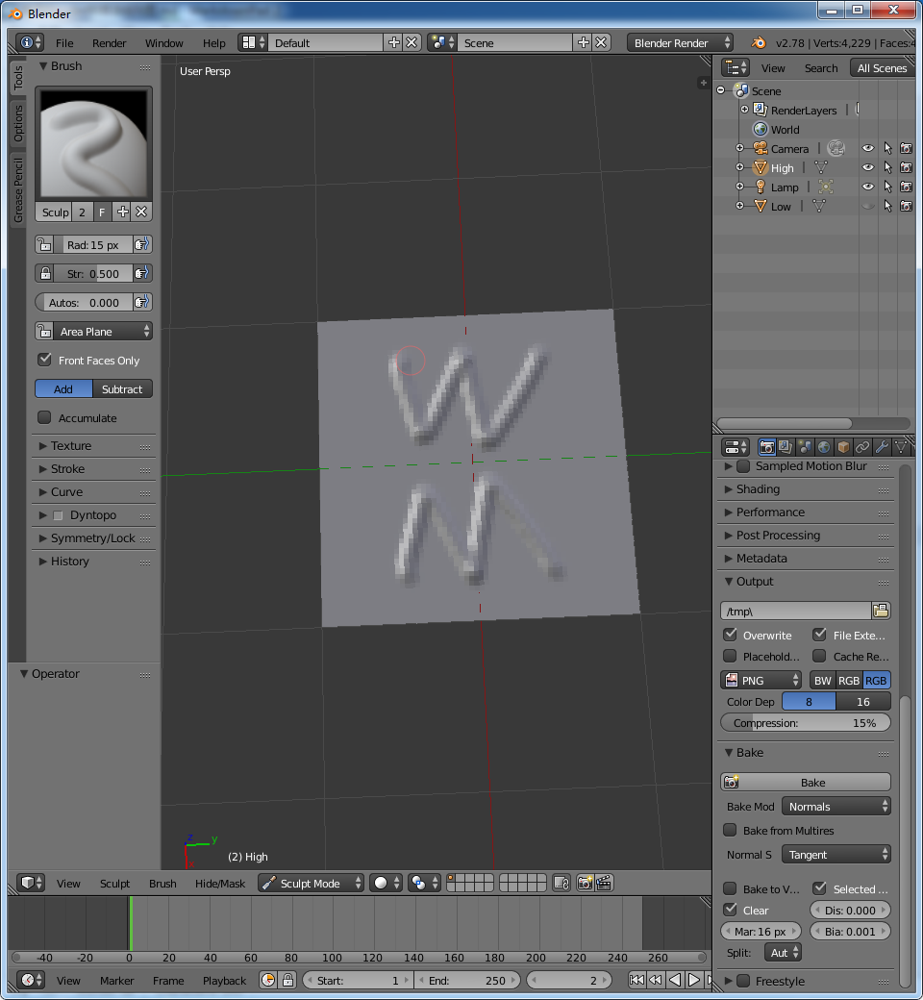
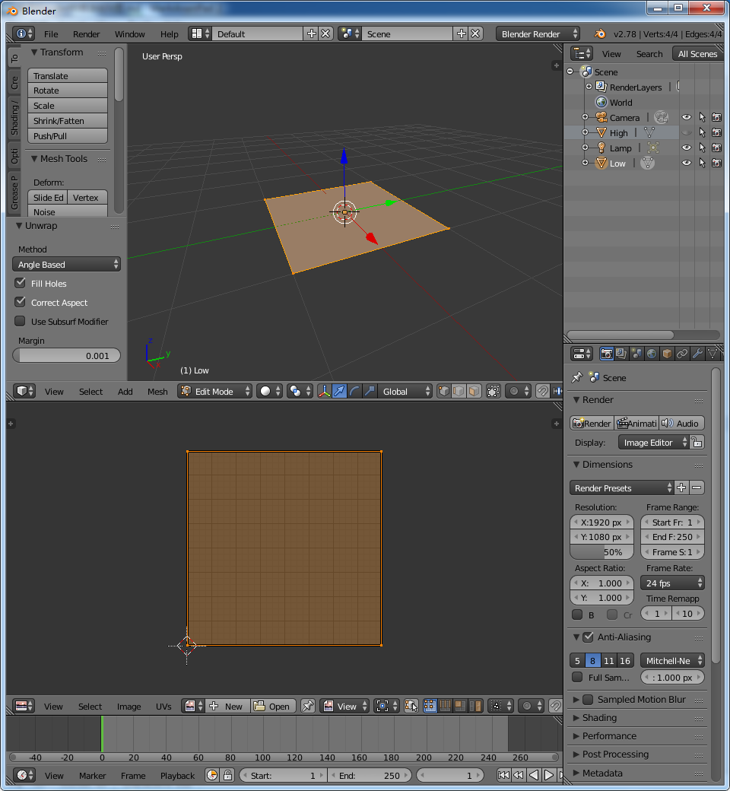
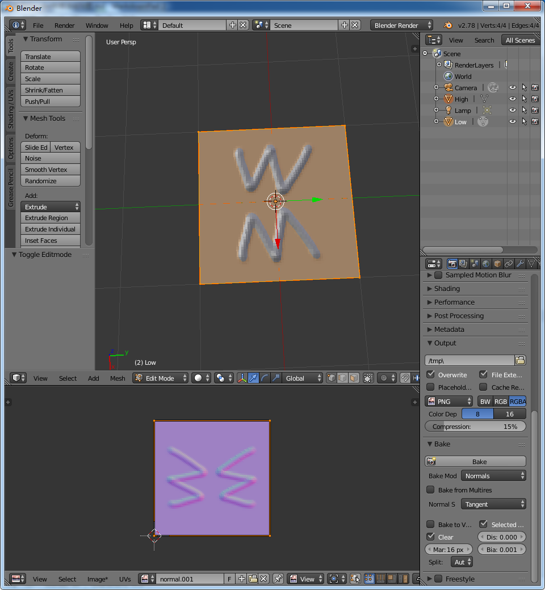

# 使用Blender烘焙法线贴图

### 1.打开Blender，删掉默认物体，在场景中创建一个Plane，命名为Low

### 2.原地复制这个Plane(Shift+D)，命名为High

### 3.隐藏Low

### 4.右键选中High，进入编辑模式(Tab)

### 5.Subdivide当前选中的模型若干次

### 6.切换到雕刻模式，在高模上进行雕刻

### 7.隐藏High模型，显示Low模型

### 8.进入编辑模式，拆分UV(快捷键U)

### 9.显示High和Low模型，先选中High模型，再Shift选中Low模型，然后Tab进入编辑模式

### 10.新建贴图

### 11.设置Bake选项，选择Bake Mod:Normal, 勾选Selected To Active

### 12.点击Bake按钮进行烘焙

### 13.选择Image/Save保存法线贴图

