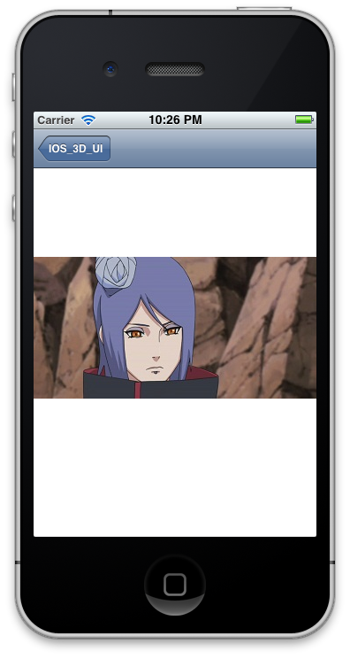
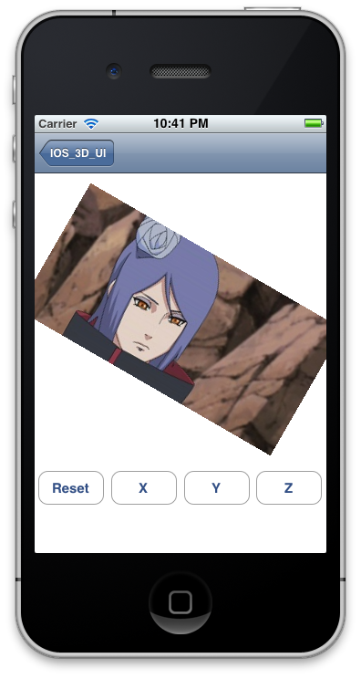
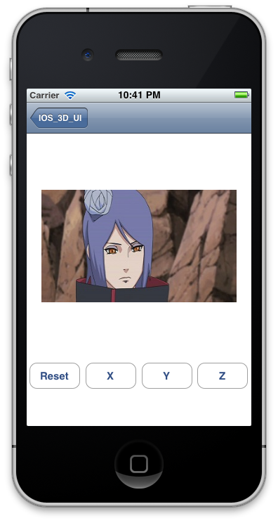
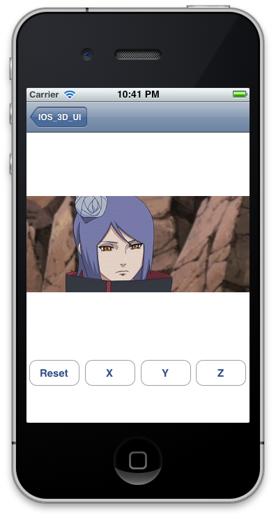
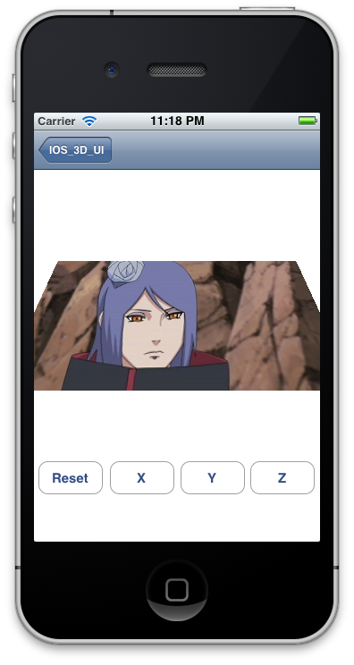
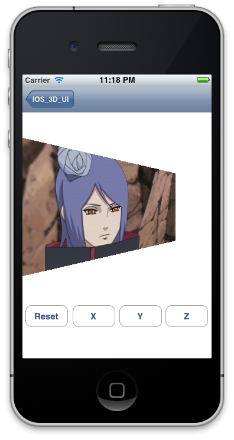
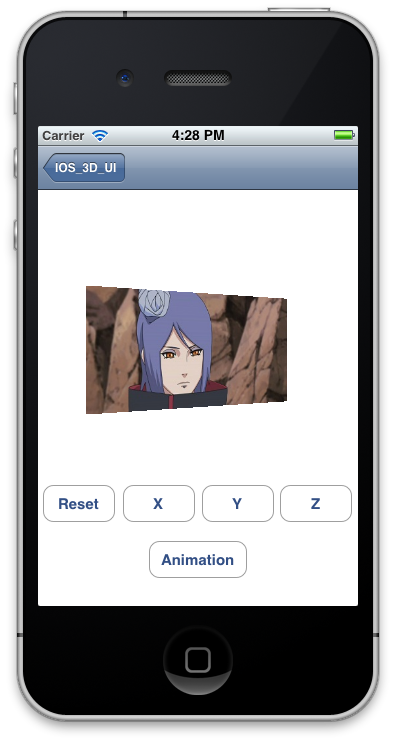
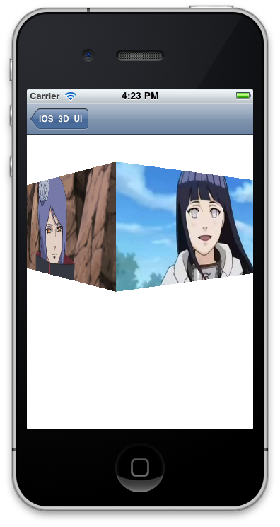
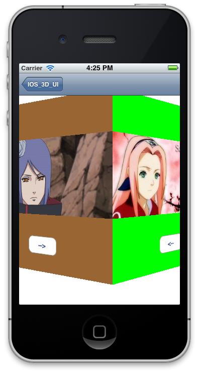

##准备
iOS的UI是基于UIView类的，我们能看到的每个UI元素都是UIView或者UIView的子类。View按树形结构组织起来，树根是UIWindow。  

View负责界面的交互和显示，其中显示部分由CALayer来完成。每个UIView包含一个CALayer实例。可以这么认为，UIView本身是不可见的，我们能看到的都是CALayer，UIView只是负责对CALayer进行管理。  

UIView的显示设置都是对CALayer属性的封装，但是这层封装掩盖了CALayer提供的3D显示功能。所以我们想让UIView显示3D的效果的话，需要直接操作CALayer。  

要操作CALayer对象，首先要在工程中包含`QuartzCore.framework`，在文件中`import <QuartzCore/QuartzCore.h>`头文件。QuartzCore.framework中包含了CALayer以及CALayer一些官方子类的定义。

通过设置CALayer的transform属性，可以使CALayer产生3D空间内的平移、缩放、旋转等变化。

##第一个例子，绕坐标轴的旋转：  
原始场景如下图  

    
使用 `image.layer.transform = CATransform3DMakeRotation(M_PI/6, 0, 0, 1);` 绕Z轴旋转30度后的效果  

    
使用 `image.layer.transform = CATransform3DMakeRotation(M_PI/6, 0, 1, 0);` 绕Y轴旋转30度后的效果  

     
使用 `image.layer.transform = CATransform3DMakeRotation(M_PI/6, 1, 0, 0);` 绕X轴旋转30度后的效果  

    
能够发现，绕Z轴的旋转比较符合预期，但是绕X轴Y轴的旋转只是在Y轴X轴上进行了一些缩放而已。这是因为，在CALayer的显示系统中，默认的相机使用正交投影，正交投影没有远小近大效果，所以在本例中，只能造成相应轴上的缩放。  
##第二个例子，透视投影
CALayer默认使用正交投影，因此没有远小近大效果，而且没有明确的API可以使用透视投影矩阵。所幸可以通过矩阵连乘自己构造透视投影矩阵。构造透视投影矩阵的代码如下：
    
    CATransform3D CATransform3DMakePerspective(CGPoint center, float disZ)
    {
        CATransform3D transToCenter = CATransform3DMakeTranslation(-center.x, -center.y, 0);
        CATransform3D transBack = CATransform3DMakeTranslation(center.x, center.y, 0);
        CATransform3D scale = CATransform3DIdentity;
        scale.m34 = -1.0f/disZ;
        return CATransform3DConcat(CATransform3DConcat(transToCenter, scale), transBack);
    }

    CATransform3D CATransform3DPerspect(CATransform3D t, CGPoint center, float disZ)
    {
        return CATransform3DConcat(t, CATransform3DMakePerspective(center, disZ));
    }

这个函数的实现原理要参考计算机图形学的3D变换部分，以后再做解释。现在只需要了解接口的含义，center指的是相机 的位置，相机的位置是相对于要进行变换的CALayer的来说的，原点是CALayer的anchorPoint在整个CALayer的位置，例如CALayer的大小是(100, 200), anchorPoint值为(0.5, 0.5)，此时anchorPoint在整个CALayer中的位置就是(50, 100)，正中心的位置。传入透视变换的相机位置为(0, 0)，那么相机所在的位置相对于CALayer就是(50, 100)。如果希望相机在左上角，则需要传入(-50, -100)。disZ表示的是相机离z=0平面（也可以理解为屏幕）的距离。

带透视效果的旋转，效果如下：
    
    CATransform3D rotate = CATransform3DMakeRotation(M_PI/6, 1, 0, 0);
    image.layer.transform = CATransform3DPerspect(rotate, CGPointMake(0, 0), 200);

    
    CATransform3D rotate = CATransform3DMakeRotation(M_PI/6, 0, 1, 0);
    image.layer.transform = CATransform3DPerspect(rotate, CGPointMake(0, 0), 200);
    
    

    CATransform3D rotate = CATransform3DMakeRotation(M_PI/6, 0, 0, 1);
    image.layer.transform = CATransform3DPerspect(rotate, CGPointMake(0, 0), 200);
    

image的默认anchorPoint为(0.5,0.5)，也就是在图片中心；眼睛在图片中心点，距屏幕200单位。可以观察到，因为翻转，使图片的不同部分离屏幕距离不同，近大远小的效果使立体感大大提升。饶Z轴的旋转不因为透视产生变化，因为所有的点离屏幕距离相同，所以不会产生近大远小的透视感。
    
##第三，更多的效果。

CALayer的旋转和缩放是绕anchorPoint点的，改变anchorPoint的值，可以使Layer绕不同的点而不只是中心点旋转缩放。在构造透视投影矩阵的例子中就可以看到，CATransform3D可以使用CATransform3DConcat函数连接起来以构造更复杂的变换。通过这些方法，可以组合出更多的效果来。下面是个翻转的动画。使用UITimer
    
    - (void)update
    {
        static float angle = 0;
        angle += 0.05f;
    
        CATransform3D transloate = CATransform3DMakeTranslation(0, 0, -200);
        CATransform3D rotate = CATransform3DMakeRotation(angle, 0, 1, 0);
        CATransform3D mat = CATransform3DConcat(rotate, transloate);
        image.layer.transform = CATransform3DPerspect(mat, CGPointMake(0, 0), 500);
    }
    

最后是两个更复杂的例子。第一个是使用四张同样大小的图片围成一个框，让这个框动画旋转。
    
    CATransform3D move = CATransform3DMakeTranslation(0, 0, 160);
    CATransform3D back = CATransform3DMakeTranslation(0, 0, -160);
    
    CATransform3D rotate0 = CATransform3DMakeRotation(-angle, 0, 1, 0);
    CATransform3D rotate1 = CATransform3DMakeRotation(M_PI_2-angle, 0, 1, 0);
    CATransform3D rotate2 = CATransform3DMakeRotation(M_PI_2*2-angle, 0, 1, 0);
    CATransform3D rotate3 = CATransform3DMakeRotation(M_PI_2*3-angle, 0, 1, 0);
    
    CATransform3D mat0 = CATransform3DConcat(CATransform3DConcat(move, rotate0), back);
    CATransform3D mat1 = CATransform3DConcat(CATransform3DConcat(move, rotate1), back);
    CATransform3D mat2 = CATransform3DConcat(CATransform3DConcat(move, rotate2), back);
    CATransform3D mat3 = CATransform3DConcat(CATransform3DConcat(move, rotate3), back);
    
    image0.layer.transform = CATransform3DPerspect(mat0, CGPointZero, 500);
    image1.layer.transform = CATransform3DPerspect(mat1, CGPointZero, 500);
    image2.layer.transform = CATransform3DPerspect(mat2, CGPointZero, 500);
    image3.layer.transform = CATransform3DPerspect(mat3, CGPointZero, 500);

上面的例子都使用UIImage的CALayer，但CALayer产生的动画可以应用在所有的UIView及子类上，下面是个普通界面的立体翻转效果。
    
    float dis = 160 * 1.732f;
    CATransform3D move = CATransform3DMakeTranslation(0, 0, dis);
    CATransform3D back = CATransform3DMakeTranslation(0, 0, -dis);
    
    CATransform3D rotate0 = CATransform3DMakeRotation(-angle, 0, 1, 0);
    CATransform3D rotate1 = CATransform3DMakeRotation(-angle + M_PI/3.0f, 0, 1, 0);
    
    CATransform3D mat0 = CATransform3DConcat(CATransform3DConcat(move, rotate0), back);
    CATransform3D mat1 = CATransform3DConcat(CATransform3DConcat(move, rotate1), back);
    
    view0.layer.transform = CATransform3DPerspect(mat0, CGPointZero, 500);
    view1.layer.transform = CATransform3DPerspect(mat1, CGPointZero, 500);
