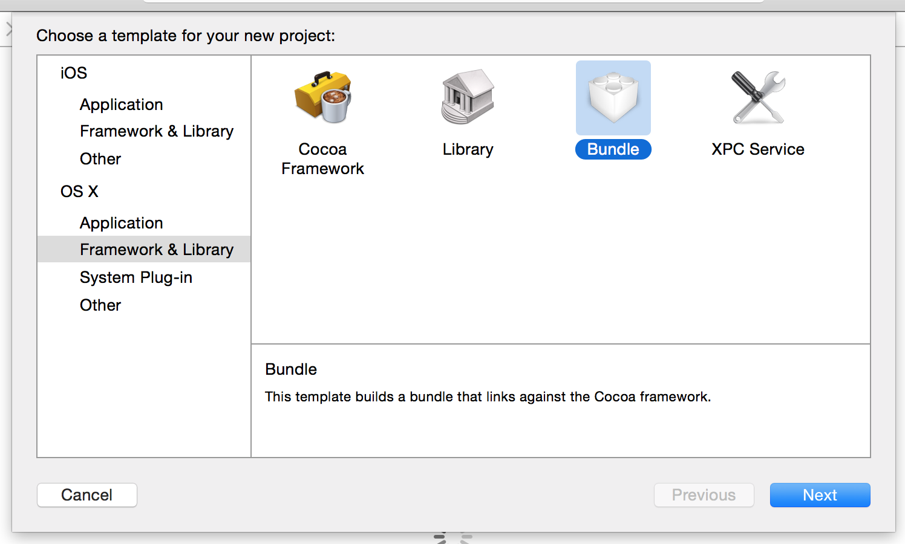
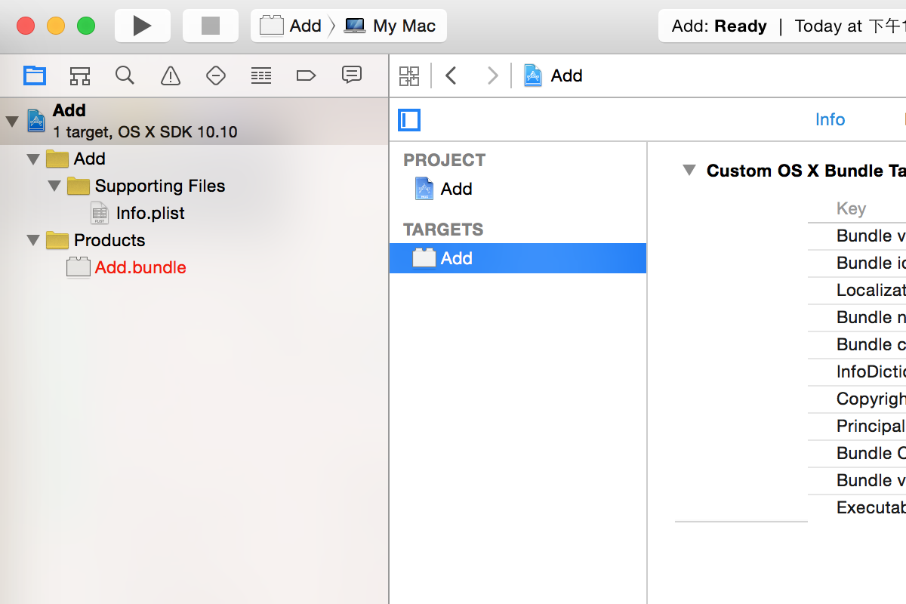
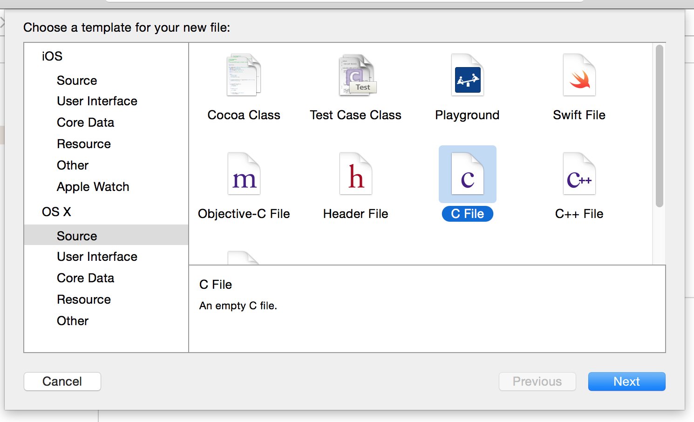
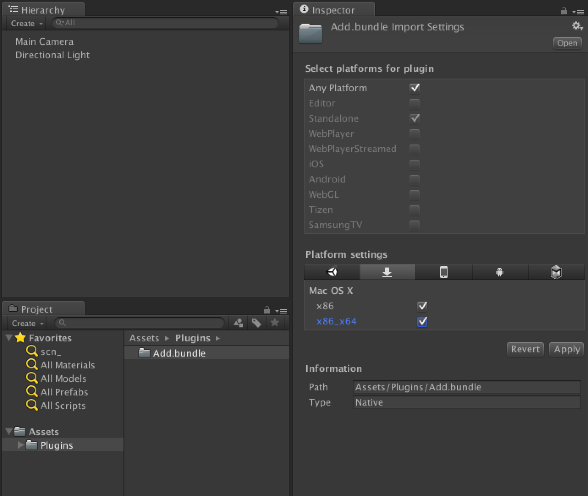

#在Unity中使用Native Plugin(XCode编译)

目标: 使用XCode将C源码编译一个动态链接库, 然后在Unity中用C#调用

环境: OS X 10.10.1, XCode 6.3.2, Unity 5.2.1

##XCode
打开XCode, 新建工程, 输入名字Add, 选择路径.

得到如下空工程.

执行File -> New -> File, 添加新文件, 选择文件类型C语言源代码, 输入名字`add.c`(对于C语言源代码来说, 名字是无所谓的)


在`add.c`中添加如下函数(只为跑通流程, 所以用比较简单的例子)

``` c
int add(int a, int b)
{
    return a + b;
}
```

然后, 执行Build, 得到`Add.bundle`文件(其实是个文件夹)
##Unity
使用Unity新建工程, 在Asset目录下新建`Plugins`目录, 将`Add.bundle`复制进来. 参数选择如下. 


在Unity中新建C#脚本`Add.cs`(名字也是无所谓的), 使用以下代码

``` csharp
using UnityEngine;
using System.Collections;
using System.Runtime.InteropServices;

public class Add : MonoBehaviour {

	[DllImport("Add")]
	public static extern int add(int a, int b);
	
	void Start () {
		Debug.Log(add(1, 2));
	}
}

```

将此脚本挂载到场景中的物体, 点击运行按钮, 可以在控制台看到输出了结果3, 说明发生了正确的调用.
